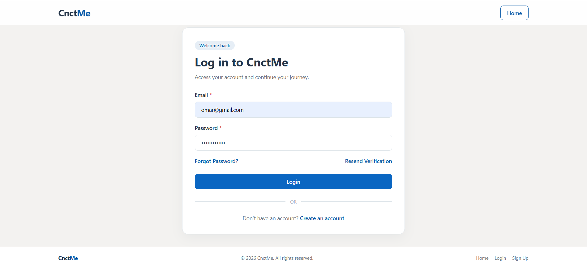

<div align="center">

# CnctMe

### Full-Stack Job Recruitment Platform

A modern MERN-based recruitment platform connecting **job seekers, recruiters, and administrators** through a complete hiring workflow.

[](https://react.dev/)
[](https://nodejs.org/)
[](https://expressjs.com/)
[](https://www.mongodb.com/)
[](https://tailwindcss.com/)

**[Live Demo](https://cnctme.vercel.app)** · **[GitHub](https://github.com/AreebaFazzal/CnctMe)**

</div>

---

## About

**CnctMe** is a full-stack job recruitment platform built with the **MERN stack**.

The platform provides dedicated experiences for three types of users:

| Role              | Capabilities                                                                                   |
| ----------------- | ---------------------------------------------------------------------------------------------- |
| **Job Seeker**    | Search jobs, save jobs, apply, track applications, manage profile and interviews               |
| **Recruiter**     | Manage company, create jobs, review applications, shortlist candidates and schedule interviews |
| **Administrator** | Manage users, companies, jobs, applications and reports                                        |

The application also includes secure authentication, role-based authorization, notifications, reporting, email functionality, and responsive design.

---

## Features

### Authentication & Authorization

- User registration and login
- Email verification
- Resend verification email
- Forgot and reset password
- JWT authentication
- Access and refresh token system
- Role-based authorization
- Protected routes
- Account verification and access control

### Job Seeker

- Browse and search available jobs
- Save jobs
- Apply with resume and cover letter
- Track application status
- View scheduled interviews
- Manage profile and account settings
- Receive notifications

### Recruiter

- Create and manage company profile
- Create and manage job postings
- Review job applications
- Update application status
- Shortlist candidates
- Schedule and manage interviews
- Receive recruitment notifications

### Administrator

- Dashboard statistics
- User management
- Company management
- Job management
- Application management
- Report management
- Platform moderation

### Additional Features

- Notifications
- Emails
- User reporting
- Public profiles
- Responsive interface
- Mobile-friendly dashboards

---

## Screenshots

### Home

<p align="center">
  
</p>

### Authentication

<p align="center">
  
</p>

### Admin Dashboard

<p align="center">
  
</p>

### Recruiter Dashboard

<p align="center">
  
</p>

### Job Seeker Dashboard

<p align="center">
  
</p>

---

## Tech Stack

| Category        | Technologies                       |
| --------------- | ---------------------------------- |
| Frontend        | React, Redux Toolkit, React Router |
| Styling         | Tailwind CSS                       |
| Backend         | Node.js, Express.js                |
| Database        | MongoDB, Mongoose                  |
| Authentication  | JWT, bcrypt                        |
| Email           | Nodemailer                         |
| HTTP Client     | Axios                              |
| Development     | Vite, ESLint                       |
| Version Control | Git, GitHub                        |
| Deployment      | Vercel                             |

---

## Application Workflow

```text
                         CnctMe
                           │
          ┌────────────────┼────────────────┐
          │                │                │
          ▼                ▼                ▼
     Job Seeker        Recruiter         Admin
          │                │                │
          ▼                ▼                ▼
      Find Jobs       Create Company    Manage Platform
          │                │
          ▼                ▼
        Apply          Post Jobs
          │                │
          └───────┬────────┘
                  ▼
          Application Review
                  │
                  ▼
             Shortlisted
                  │
                  ▼
              Interview
                  │
          ┌───────┴───────┐
          ▼               ▼
       Selected        Rejected
```

---

## Project Structure

```text
CnctMe/
│
├── CnctMe-Backend/
│   ├── config/
│   ├── controllers/
│   ├── middleware/
│   ├── models/
│   ├── routes/
│   ├── services/
│   ├── utils/
│   ├── validators/
│   ├── .env.example
│   ├── .gitignore
│   ├── package-lock.json
│   ├── package.json
│   └── server.js
│
├── CnctMe-Frontend/
│   ├── public/
│   ├── src/
│   │   ├── api/
│   │   ├── app/
│   │   ├── assets/
│   │   │   └── images/
│   │   ├── components/
│   │   ├── features/
│   │   ├── pages/
│   │   ├── routes/
│   │   ├── utils/
│   │   ├── App.jsx
│   │   ├── index.css
│   │   └── main.jsx
│   ├── .env.example
│   ├── .gitignore
│   ├── eslint.config.js
│   ├── index.html
│   ├── package-lock.json
│   ├── package.json
│   ├── vercel.json
│   └── vite.config.js
│
└── README.md
```

---

## Getting Started

### Clone

```bash
git clone https://github.com/AreebaFazzal/CnctMe.git
cd CnctMe
```

### Backend

```bash
cd CnctMe-Backend
npm install
npm start
```

### Frontend

Open a new terminal:

```bash
cd CnctMe-Frontend
npm install
npm run dev
```

Create `.env` files for both applications using the provided `.env.example` files.

> Never commit `.env` files or sensitive credentials.

---

## Security

CnctMe implements several security measures, including:

- JWT-based authentication
- Short-lived access tokens
- HTTP-only refresh token cookies
- Password hashing with bcrypt
- Email verification
- Password reset tokens
- Role-based access control
- Protected API routes
- Account status validation

---

## Deployment

**Frontend**

https://cnctme.vercel.app/

**Backend**

https://cnctme-backend.vercel.app/

---

## Author

**Areeba Fazzal**

Full-Stack MERN Developer

[GitHub](https://github.com/AreebaFazzal)

---

<div align="center">

**CnctMe — Connect. Discover. Hire.**

If you found this project useful, consider giving the repository a star.

</div>
